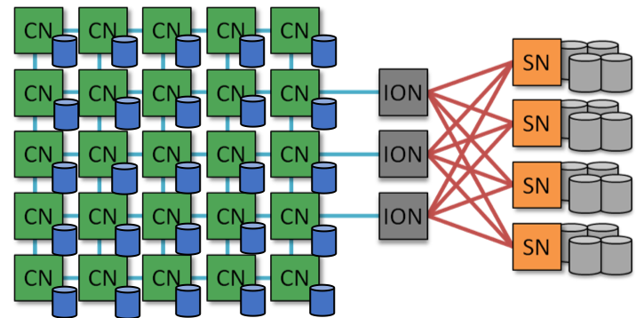
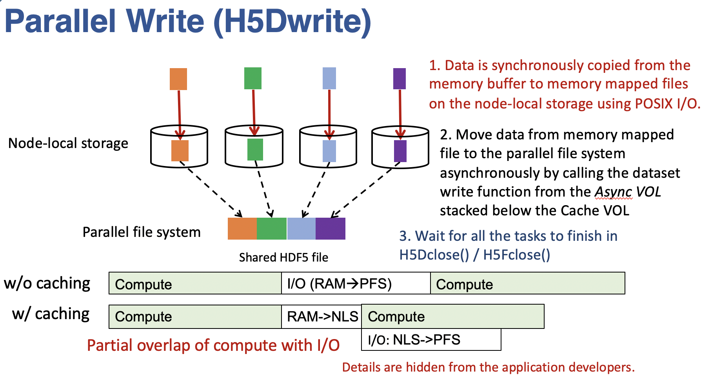
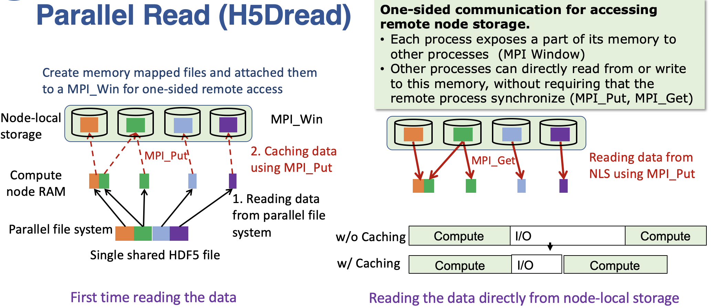

Introduction
=============

Modern era high performance computing (HPC) systems are providing multiple levels of memory and storage layers to bridge the performance gap between fast memory and slow disk-based storage system managed by global parallel file system such as Lustre and GPFS. Several of the recent HPC systems are equipped with SSD and NVMe-based storage locally attached to compute nodes. Some systems are providing an SSD-based "burst buffer" that is accessible by all compute nodes as a "global" file system, such as the burst buffer on Cori supercomputer at NERSC. Although these hardware layers are intended to reduce the latency gap between memory and disk-based long-term storage, utilizing the fast layers has been left to the users. To our knowledge, fast storage layers have been often used as a scratch space as slow a "memory" extension to the compute node RAM. They are rarely integrated into parallel I/O workflow.

We developed Cache VOL to transparently manage the fast storage layers inside the HDF5 library to improve the overall parallel I/O performance. Cache VOL utilizes node-local memory and storage, as well as global burst buffer storage layers as transparent caching or staging layers inside the HDF5 library, without placing the burden of managing these layers on users. It can be stacked together with Async VOL to asynchronously transfer data between different layers of storage in the background, thus hiding most of parallel I/O overhead behind the computation. Please refer to the getting started section for more details on how to stack Cache VOL and Async VOL together.

---------------------
High-level Design
---------------------

The key design in Cache VOL is to intercept the HDF5 read and write calls to stage / cache data on the fast storage layer, and then move the data to / from the global parallel file system automatically in the library. The VOL framework provides an easy way to intercept H5Dwrite and H5Dread HDF5 API calls to achieve this purpose.

'''''''''''''''''''''
Parallel write
'''''''''''''''''''''
In the parallel write case, the application writes the data to the fast storage layers; then the library take care of the data migration in the background while the application continue to proceed to other part of the simulation.

The fast storage layer can be either local to each compute node or global with unified namespace. We treat these two scenarios differently:

1. For node-local storage, each process creates an independent binary file on the storage device for storing the cache data. Specifically, at each dataset write call (H5Dwrite), every process writes its own data to the cache file using POSIX write, and then issues an asynchronous dataset write call to flush the data to the parallel file system. The H5Dwrite call returns right after then without waiting for the flushing to finish. In order to avoid extra memory allocation or memory copy, the cache file is mapped into the virtual memory via mmap. 

2. For global storage, a mirror HDF5 file is created on the cache storage. At each dataset write call (H5Dwrite), data is written to the mirror HDF5 file using native HDF5 dataset write call. During the data migration process, data is first read back to the memory from the mirror HDF5 file and then written to the HDF5 file on the parallel file system. Both the read and write operations involved in this process are performed asynchronously. In this case, each process does need to allocate a memory buffer to temporally hold the data during the data migration. The buffer is freed after data has been written to the parallel file system. To avoid uncontolled memory usage, we allow only one data migration task at a time.

We highlight a few features as follows:

1. Data migration from the fast storage layer to the parallel file system is performed asynchronously in the background through Async VOL. This enables the application to hide majority of the I/O overhead behind the computation or other parts of the application. For best benefit therefore, the application should have sufficient amount of computation work to overlap with the data migration.

2. The H5Dwrite call appears as a semi-blocking call. The function call will return right after the data has been written to cache storage layer. Then the write buffers are immediately reusable for other purposes.

3. There is no extra memory allocation needed during the whole process for the node-local storage case. Data are staged in the memory-mapped files on the node-local storage. We use mmap pointers to address the data on the fast storage. For global storage case, an additional memory buffer is needed which will increase the memory footprint accordingly.  

4. Data is guaranteed to be flushed to the parallel file system at the end of H5Fclose call. We wait for all the data migration tasks to finish before closing the dataset or the file at H5Dclose or H5Fclose. 

5. We also support merging several dataset writes call into a single write. This is particularly useful when there are a large number of small write requests in the applications. Merging small requests will help to reduce the overhead significantly.
'''''''''''''''''''
Parallel read
'''''''''''''''''''
  
In the parallel read case, the main idea is to stage data to the fast-storage layer first and then read them directly from there for future requests. This will benefit the workloads that read the same dataset repeatedly while the entire dataset cannot be fit into the system memory. One example is the deep learning workload.

	   
* Node Local Storage: 
  Parallel read usually involves reading data from remote node's local storage. Therefore, we need to have a mechanism to efficiently locate and fetch the data. User level file system such as UnifyFS (https://unifyfs.readthedocs.io) is potentially a solution. However, UnifyFS requires dedicate computing resource to run a server together with the application on the same set of compute nodes. This might not be allowed in some supercomputers such as Theta. We propose a light weight server-free shared file system through memory map. 

  We divide the dataset into equal partitions, and predetermine where to cache each of the partitions. Memory-mapped files are created on the node-local storage, one per process, with size equal to the size of the partition to be cached. We then associate the mmap pointer to a MPI Window to share the portion of the storage to other processes. All the processes can then store and load data from and to the remote nodes using RMA calls such as MPI_Put and MPI_Get. In this way, each process can get data from remote nodes without the involvement of the other processes.

  Due to some challenging in managing the metadata without using a server, in our custom file system, we support only the cases where the dataset is a multi-dimensional array of shape (n_samples, d_1, d_2, d_3, ..., ), and we assume each request will read only complete samples. In this case, the amount of metadata we have to manage is very minimal. There is no need of a metadata server to manage this. Fortunately, most of the workloads fit into this scenario. 

* Global storage: 
  For global storage, it is simpler than the case of node-local storage. Similar to the parallel write case, we create a mirror HDF5 file on the global storage, and data is cached to the global storage using HDF5 dataset write function from native dataset VOL. For any future read request, data will be read directly from the mirror HDF5 file on the global storage. For global storage, our framework supports all generic read, including those reading only part of a sample. 
  
We support two caching / staging schemes:

* On-the-fly caching: each time, when new samples are read from the parallel file system, we store a copy to the node-local storage. Currently, the caching is done synchronously.

* One-time prestaging: the entire dataset can be cached to the node-local storage all at once through H5Dprefetch call. In this case, we support both asynchronous and synchronous staging.   
  
---------------------
Targeting workloads
---------------------
Cache VOL is design to support following two types of workloads: 

1. Intensive repetitive read workloads, such as deep learning applications. In such workloads, the same dataset is being read at every epoch, typically in a batch streaming fashion. The workloads are typically distributed in a data-parallel fashion. One can use Cache VOL to stage the data on the fast storage at the first epoch and read them there in later epochs without going to the parallel file system. There will be some overhead in the first epoch from caching data to the fast storage layer. 

2. Heavy check-pointing workloads. Simulations usually write intermediate data to the file system for the purpose of restarting or post-processing later. The check-pointing data is not immediately read back to the application. Using Cache VOL, the check-pointing data will be written to the fast storage first and then migrated to the parallel file system asynchronously without blocking the simulation. 
